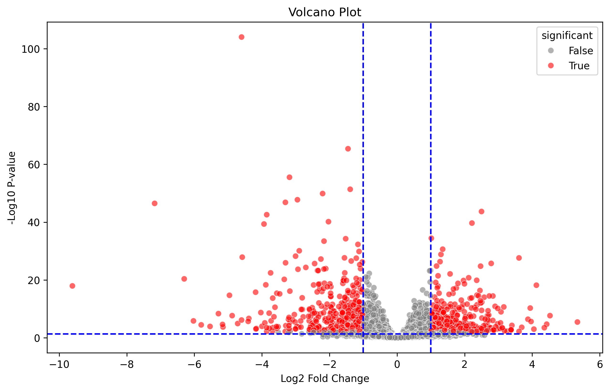

# 🧬 RNA-Seq Differential Expression Analysis (DESeq2 + Python)

This project demonstrates a complete RNA-Seq workflow using **DESeq2 in R** for differential gene expression analysis and **Python (Pandas/Seaborn)** for visualization.

---

## 📁 Project Structure
rna_seq_project/
│
├── 01_deseq2_analysis.R # R script for DESeq2 analysis
├── 02_deseq2_visualization.ipynb # Python notebook for plotting results
├── deseq2_results.csv # Exported results from DESeq2
├── plots/
│ └── volcano_plot.png # Volcano plot of DEGs
└── README.md # Project overview

---

## 🧪 Dataset

We used the built-in `airway` dataset from Bioconductor, which includes RNA-Seq gene expression profiles from human airway smooth muscle cells with and without dexamethasone treatment.

---

## 🧠 Methods

- **R/DESeq2**: Read count normalization, dispersion estimation, and differential expression testing
- **Filtering**: Genes with low counts were removed prior to DESeq2 modeling
- **Significance Threshold**:  
  - Adjusted p-value (`padj`) < 0.05  
  - Absolute log2 fold change > 1

---

## 📊 Visualizations

- **Volcano Plot**: Highlights significantly up/down-regulated genes  
  

- *(Optional additions: heatmap, PCA plot, top gene bar chart, etc.)*

---

## 🔁 Reproducibility

### Requirements

- R (≥ 4.0), Bioconductor, `DESeq2`, `airway`
- Python 3, `pandas`, `matplotlib`, `seaborn`, `numpy`

### To Run:
1. In R: run `01_deseq2_analysis.R` to generate `deseq2_results.csv`
2. In Python: open `02_deseq2_visualization.ipynb` to generate plots

---

## 💡 Notes

This project simulates a real-world bioinformatics workflow used in research labs and biotech settings. It combines the statistical power of **R** with the visualization flexibility of **Python**, following a clean, modular pipeline.

---

## 🚀 Author

**Ankush Goyal**  
Project built as part of portfolio development and bioinformatics learning.
